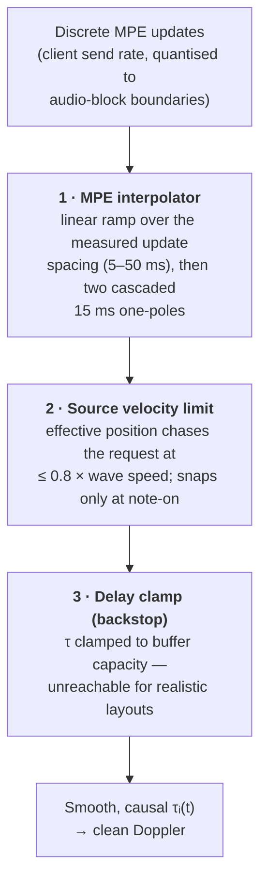
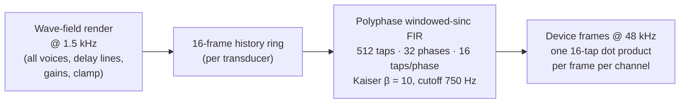

# The Delay-Line Doppler Source

*Design documentation for the wave-propagation stimulus at the heart of `haptic-server` (`haptic-server/src/engine.rs`, `WaveStimulus`). High-level companion to `ARCHITECTURE.md`; current status lives in `ROADMAP.md`.*

## 1. The idea in one paragraph

Each active note is modelled as a **point source** moving on the surface of the table, emitting a sinusoid in the 20–200 Hz haptic band. Every transducer receives that sinusoid **delayed by its physical distance to the source divided by the wave speed**, via a per-transducer fractional delay line. Because the delays are recomputed from the source position on every rendered frame, a *moving* source continuously changes each delay — and a time-varying delay is exactly a phase modulation whose derivative is a frequency shift. **Doppler is therefore an emergent property of the delay lines, not a feature that is computed.** There is no explicit Doppler code anywhere in the engine, and none should be added: the delay model produces the physically correct shift, including the correct asymmetry between approach and recession, for free.

```
        table (1 m × 2 m default, 4×8 cell-centred grid)
   ┌──────────────────────────────────────────────┐
   │   o      o      o      o      o      o       │   o  transducer i at xᵢ
   │                          ~~~                 │
   │   o      o      o     ~ ✚ →~   o      o      │   ✚  source at xₛ(t), moving
   │                          ~~~                 │      with velocity v
   │   o      o      o      o      o      o       │
   │        ↑ approaching: delay τᵢ shrinking     │   each o hears s(t − τᵢ(t))
   │          → frequency raised (Doppler)        │   τᵢ(t) = |xᵢ − xₛ(t)| / c
   └──────────────────────────────────────────────┘
```

Formally, transducer *i* outputs `s(t − τᵢ(t))` with `τᵢ(t) = |xᵢ − xₛ(t)| / c`. For a sinusoid `s(t) = sin(2πf₀t)` the instantaneous frequency at the transducer is

```
fᵢ(t) = f₀ · (1 − (d/dt)|xᵢ − xₛ(t)| / c)
```

— the classical Doppler formula, with `c` the configurable wave speed (default 20 m/s, range 0.25–1000 m/s). Wave speeds this low make the effect *strong*: at c = 1 m/s a source orbiting at a few tens of cm/s produces deep, audible (and palpable) pitch trajectories.

## 2. Signal path

```mermaid
flowchart LR
    subgraph clients["Clients (plugin / viewer)"]
        MPE["MPE events<br/>note on/off, bend,<br/>pressure, timbre"]
    end
    MPE -->|"Unix socket, framed bincode"| IPC["IPC thread"]
    IPC -->|"rtrb SPSC ring"| DRAIN["drain_commands()<br/>once per audio callback"]

    subgraph voice["WaveStimulus (per voice, ×8 pool)"]
        SMOOTH["MPE interpolator<br/>ramp + 2× one-pole"]
        POS["source position<br/>velocity-limited chase"]
        OSC["sine oscillator<br/>× envelope × pressure"]
        DL["32 fractional<br/>delay lines"]
        ATT["distance<br/>attenuation"]
        SMOOTH --> POS --> DL
        OSC --> DL --> ATT
    end
    DRAIN --> voice

    ATT -->|"mix voices, per-transducer<br/>gain, ±1 clamp"| RENDER["internal frame<br/>@ 1.5 kHz"]
    RENDER --> FIR["polyphase sinc<br/>reconstruction ×32"]
    FIR -->|"monitor routing"| DEV["cpal device<br/>@ 48 kHz"]
    RENDER -.->|"VoiceSnapshot ring"| VIEW["haptic-viewer<br/>phase visualiser"]
```



Everything inside the audio callback is allocation- and lock-free: the engine is *owned* by the callback, commands and layout hot-reloads arrive on `rtrb` SPSC rings, and voice snapshots leave on a third ring (dropped when full).

## 3. The delay line

Each `WaveStimulus` owns 32 independent delay lines — one per transducer — because each transducer sits at a different distance and needs its own tap. A delay line is a heap-allocated ring buffer (`Box<[f32; 16384]>`) with a single write head and a **fractional read tap** placed `τᵢ · sample_rate` samples behind it, linearly interpolated between the two neighbouring samples so that delay can vary continuously:

```
      write head (advances 1/frame)
           ▼
  ┌──┬──┬──┬──┬──┬──┬──┬──┬──┬──┬──┬──┬──┬──┬──┐
  │  │  │▒▒│  │  │  │  │  │ ●│  │  │  │  │  │  │   ring, 16384 frames
  └──┴──┴──┴──┴──┴──┴──┴──┴──┴──┴──┴──┴──┴──┴──┘   (~10.9 s @ 1.5 kHz)
                           ▲
              read tap, delay τᵢ·rate behind the head
              (fractional: lerp between neighbours;
               moves as the source moves → Doppler)
```

Per frame, each line does one write, one interpolated read, and the output is scaled by the distance attenuation `1 / (1 + 2d)`. Delays beyond capacity are **clamped, never wrapped** — a wrap would read the just-written sample, i.e. silently produce *zero* delay, which is precisely the latent bug the 1×2 m table exposed (see §6).

## 4. Keeping the model stable: three protective layers

The physics is one line; almost all of the engineering is making a *time-varying* delay behave. Three independent mechanisms, at three timescales, keep the delay trajectories smooth and causal.



**Layer 1 — MPE interpolation** (`MpeInterp`). Controller updates arrive as discrete steps, further staircased to audio-block boundaries by the command queue. Feeding steps straight into the delay computation frequency-modulates the lines at the update rate, spraying an FM sideband comb around the carrier. Each new target is instead ramped linearly over roughly the *measured* arrival spacing (clamped 5–50 ms) — making smoothness independent of the client's send cadence — and the ramp output passes through two cascaded 15 ms one-poles (the second pole buys ~19 dB of extra sideband suppression for ~15 ms of position lag). Verified by buffer capture: in-band artefacts fell from −41.6 to −53 dB at c = 1 m/s.

**Layer 2 — subsonic source** (`SOURCE_SPEED_FRACTION = 0.8`). If the source outruns its own waves, some delay shrinks faster than one sample per sample and the read tap overtakes the write head — the delay line is read *backwards* and the Doppler model collapses. The effective source position therefore chases the MPE-requested position at no more than 0.8 × c. The position snaps directly to the request at note-on only (a new note must not sweep in from wherever the stolen slot's previous voice sat). The viewer visualises this pair: a ring at the requested position, a cross at the effective source, a tether while it catches up.

**Layer 3 — capacity clamp.** A last-resort clamp of τ to the buffer length. When it engages, Doppler silently dies for that transducer (a clamped delay is a constant delay), so the design goal is to make it unreachable — which is what the rate architecture below achieves. The wave-speed floor (0.25 m/s) is chosen so a full-table propagation still fits.

## 5. The two-rate architecture

The haptic band ends at 200 Hz, but the device runs at 48 kHz. Rendering the wave field at the device rate wastes 32× the delay-line work *and* — the real killer — limits delay capacity in seconds. The engine instead renders at the device rate ÷ 32 (`RENDER_DECIMATION`), i.e. **1.5 kHz**, whose 750 Hz Nyquist comfortably covers the band:



Consequences:

- **Delay capacity stretches 32×**: 16384 internal frames ≈ 10.9 s of propagation. 8.3 s covers the full default table even at the 0.25 m/s wave-speed floor, so the §4 clamp never engages for realistic layouts.
- **Per-frame delay-line cost drops 32×.**
- **Reconstruction is a single filter doing two jobs**: the polyphase sinc both interpolates the internal-rate signal up to 48 kHz and suppresses its spectral images. Each device frame costs one 16-tap dot product per channel; each branch has unity DC gain (no amplitude ripple at the internal rate); first-image rejection is > 90 dB by unit test, −107 dB by capture (the f32 noise floor). Group delay is ~5.3 ms — irrelevant at haptic timescales.
- The upsampler state persists across callbacks, so device block sizes need not divide the decimation factor (regression-tested: chunked and whole renders are bit-identical).

The earlier linear-interpolation upsampler was replaced after its images (~−50 dB above 1 kHz) proved audible on monitors; the delay-line and Doppler behaviour was unchanged by the swap, only the reconstruction quality.

## 6. Failure modes that shaped the design

Each protective mechanism above earned its place by a concrete, captured failure:

| Symptom | Root cause | Fix |
|---|---|---|
| Far-corner transducer sounded *immediately* (no propagation delay) on the 1×2 m table | Worst-case delay (diagonal ÷ 20 m/s ≈ 112 ms) exceeded the then-100 ms buffer; the overflow path wrapped and read the just-written sample | Bigger buffers, clamp-not-wrap semantics (§3) |
| Pitch *steps* at the orbit period; Doppler vanishing over arcs of the orbit | Delay hitting the capacity clamp — a clamped delay is Doppler-free | Two-rate render stretching capacity to ~10.9 s (§5) |
| Sideband comb around the carrier at the audio-block/MPE-send rate | Stepped position targets frequency-modulating the delay lines | Measured-spacing ramp + double one-pole (§4, layer 1) |
| Garbled output on fast MPE jumps | Source moving supersonically; read tap overtaking the write head | 0.8 × c source velocity limit (§4, layer 2) |
| Audible high-frequency images on monitors | Linear-interp upsampler images at ~−50 dB | Polyphase Kaiser-sinc reconstruction, images at −107 dB (§5) |

The debugging instrument for all of these is the headless capture harness (`orbit_capture_writes_debug_buffers` in `engine.rs`): it drives `process_block` with the viewer's exact orbit command stream against a dummy 32-channel sink and writes raw 32-channel f32 output for offline spectral analysis. Design-level claims above (image rejection, sideband levels, pitch-jump counts) were verified against those captures, and the load-bearing properties are pinned by unit tests (delay-not-wrap, velocity limit, per-branch DC gain and image rejection, block-size invariance).

## 7. Boundaries of the model

Deliberate simplifications, so future work doesn't mistake them for oversights:

- **Direct path only.** No reflections at table edges, no standing-wave structure, no dispersion (all frequencies travel at the same c). Real standing-wave spatial structure is the Phase E research track; `StandingWaveStimulus` is currently an in-phase placeholder, not a wave model.
- **2D geometry, isotropic medium.** Transducer positions and the source live on a plane; attenuation is the ad-hoc `1/(1 + 2d)`, not a fitted physical law.
- **Per-voice independence.** Voices superpose linearly; there is no inter-voice interaction. Each of the up-to-8 wave voices carries its own 32 delay lines and its own wave speed (captured at note-on from the `WaveSpeed` parameter).
- **One snapshot, one voice.** The visualiser is fed the most recently started active voice only (`VoiceSnapshot`), a deliberate simplification of the status channel, not of the synthesis.
