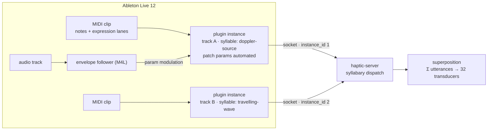
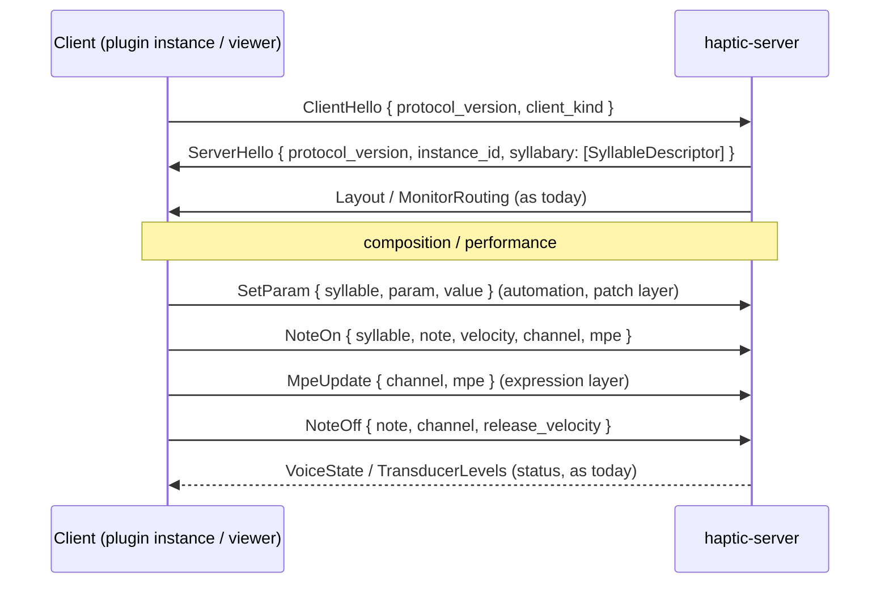

# The Syllabary Protocol — design draft

*Status: **draft / stub**, started 2026-07-20. This is a living design document for the expressive note-type protocol layered on top of MPE — the composition-facing counterpart to the wire mechanics in `haptic-protocol`. Nothing here is implemented unless explicitly marked. Companion docs: `docs/doppler-delay-line-design.md` (the first syllable's synthesis model), `ARCHITECTURE.md`, `ROADMAP.md`.*

## 1. Goal

The server will recognise a small vocabulary of **haptic event types** — a *syllabary* — of which the delay-line Doppler source is the first. Every sounding note is an *utterance* of one syllable; the server sums all sounding utterances of all types in superposition on the physical hardware (this superposition already exists: pools are mixed in `render_frame`).

The controller side is not a live instrument first — it is a **partial data-entry device for composing haptic accompaniment** to musical arrangements: Push 3 sending MPE into Ableton Live 12, notes and their expression recorded into clips, edited offline in Live's per-note expression lanes, automated in the arrangement, and optionally modulated live by audio analysis of other tracks ("hybrid reactive input"). The protocol must therefore make every expressive dimension **recordable, editable, and automatable in Live** — a parameter that can only be set programmatically is a dead parameter for this workflow.

## 2. What the toolchain actually gives us

The design space is bounded by what survives the Push 3 → Live 12 → VST3 path. This is the hard constraint set; everything in §3–§6 is arranged around it.

**Per note** (MPE — and, critically, all five are editable per-note in Live 12's clip expression lanes):

| Dimension | Source on Push 3 | Resolution | Notes |
|---|---|---|---|
| Note number | pad | 7-bit | also selects the pad-grid layout cell |
| Strike velocity | pad hit | 7-bit | one-shot, at note-on |
| Release velocity | pad release | 7-bit | one-shot, at note-off; currently unused by us |
| Pitch bend | finger x-slide | 14-bit continuous | per-note channel bend, ±48 st zone default |
| Pressure | poly aftertouch | 7/14-bit continuous | per-note channel pressure |
| Timbre / slide (CC74) | finger y-position | 7-bit continuous | the MPE "third dimension" |

**Not available per note:** arbitrary CCs. MPE fixes the per-note vocabulary at exactly the five rows above; Live will not record or edit other per-note controllers. Any parameter beyond these must ride a different layer.

**Per plugin instance** (≙ per Live track): VST3 parameters — automatable in the arrangement with breakpoint envelopes, mappable from Push encoders, and targetable by Max-for-Live devices (e.g. an Envelope Follower listening to an audio track — this is the reactive input path). One instance per track; a composition will run **several instances concurrently against one server**.

**Consequence — the four-layer control model.** Every syllable parameter must be assigned to exactly one layer:

| Layer | Carrier | Rate | Editable in Live as |
|---|---|---|---|
| **Identity** | note number, instance | at note-on | notes in a clip |
| **Articulation** | strike / release velocity | one-shot | velocity lanes |
| **Expression** | bend, pressure, timbre | continuous per-note | expression lanes |
| **Patch** | VST3 parameters → `SetParam` | continuous per-instance | automation lanes / M4L modulation |

Expression is the scarce resource: **three continuous per-note dimensions, total.** The syllabary's central design task is deciding, per syllable, what those three dimensions mean — and being honest that everything else is patch-level.

## 3. Concepts and vocabulary

- **Syllable** — a haptic event type the server knows how to synthesise (a synthesis model + parameter schema + default MPE binding). Identified by a stable `SyllableId`.
- **Utterance** — one sounding instance of a syllable (what the engine calls a voice).
- **Binding** — the per-syllable assignment of the three expression dimensions (+ two articulation values) onto that syllable's parameters. Each syllable ships a default binding; bindings are data, not code, so they can later be reconfigured per patch without protocol changes.
- **Patch** — the per-instance parameter state (the automatable layer), latched or live-applied per parameter (see §5).
- **Superposition** — the server-side sum of all utterances across all syllables and all client instances, through per-transducer gains and the safety clamp.

## 4. The syllabary (stub)

Initial vocabulary. `doppler-source` exists as `WaveStimulus`, and
`travelling-wave` now occupies the former second stimulus-type slot. The
runtime vocabulary contains only `doppler-source` (`Wave`) and
`travelling-wave` (`TravellingWave`). The remaining rows are longer-term
research names, not runtime stimulus types.

| SyllableId | Model | State | One-line character |
|---|---|---|---|
| `doppler-source` | moving point source through per-transducer delay lines | **implemented** | a thing moving on the table |
| `travelling-wave` | instantaneous radial phasor around a movable source | **implemented** ([implementation record](travelling-wave-implementation-plan.md)) | wave-like spatial phase with no propagation history |
| `spatial-sweep` | source translating along an authored path | planned | a gesture crossing the body |
| `chaotic-network` | coupled-oscillator network excited by input energy | planned | textural, self-organising activity |
| `impact` | one-shot transient with spatial origin | tentative | a discrete touch/tap event |

### 4.1 Worked example: `doppler-source`

The motivating case, including the two attenuation parameters from the delay-line doc (`g(d) = (1 + d/d₀)^(−p)`). Full parameter schema with layer assignments:

| Param | Meaning | Layer | Binding / carrier | Apply semantics |
|---|---|---|---|---|
| `frequency` | oscillator Hz via haptic note map | identity | note number | at note-on |
| `level` | base amplitude | articulation | strike velocity | at note-on |
| `pos_x` | source x on table | expression | **bend** → 0..width | continuous, smoothed |
| `pos_y` | source y on table | expression | **timbre** → 0..length | continuous, smoothed |
| `intensity` | playing pressure → output level | expression | **pressure** | continuous, smoothed |
| `wave_speed` | c, m/s | patch | VST3 param | **latched at note-on** |
| `atten_d0` | d₀, knee distance, m | patch | VST3 param | live, smoothed |
| `atten_p` | p, spreading exponent | patch | VST3 param | live, smoothed |
| `release_shape` | release curve/time scale | articulation | release velocity | at note-off |

Two tentative judgements worth recording:

- **d₀ and p are patch-layer, not expression-layer — by scarcity, not by nature.** With only three continuous dimensions and position rightly claiming two of them, attenuation shape can't have a per-note stream in the default binding. But the *binding* abstraction keeps the door open: an alternative binding (say, `radiance`) could map pressure → d₀ — pressing harder spreads the energy footprint wider instead of louder — trading intensity control away. This is exactly why bindings are per-syllable data rather than hardcoded: the protocol shouldn't have an opinion about which three parameters deserve fingers.
- **Latch vs. live is a per-parameter physical question, not a policy.** `wave_speed` must latch at note-on for `Wave`: its delay geometry and 0.5·c source-speed limit are emission-history state. The same parameter is live for `TravellingWave` because its wavenumber is instantaneous and ramped. `atten_d0`/`atten_p` are live for both, although already-scheduled Wave energy retains its emission-time gain. Each schema entry therefore carries its apply semantics explicitly.

### 4.2 Binding sketches for later syllables (tentative, to be revised when each is designed)

- `travelling-wave`: note → oscillator frequency; pressure → intensity; bend/timbre →
  source position, matching `doppler-source`. Patch: speed/fixed-wavelength
  mode, wave speed, wavelength, `atten_d0`, and `atten_p`. Spatial-scale and
  attenuation parameters apply live; there is no delay-line history or Doppler.
- `spatial-sweep`: note → path selection from a patch-defined path bank; velocity → traversal rate; pressure → intensity; bend → path offset/scrub; timbre → path width. Patch: path definitions (config, not wire), rate scaling.
- `chaotic-network`: pressure → injected energy; bend/timbre → coupling-space coordinates. Patch: topology, damping, chaos parameter.
- `impact`: everything articulation + identity (velocity → force, note → nominal position cell); expression streams largely unused — honest one-shots.

## 5. Syllable selection: one instance, one syllable

**Tentative judgement: the plugin instance (= Live track) selects the syllable**, via a patch-layer `syllable` parameter, stamped by the plugin into every `NoteOn` it sends. One track per haptic instrument.

Why this beats the alternatives:

- **It is the Ableton composition model.** One clip lane per instrument, per-track automation of that syllable's patch params, per-track M4L reactive routing, per-track record-arm from Push. The "data entry device" workflow falls out for free.
- **Note range partitioning** (registers → syllables) was rejected: it steals pitch space (already compressed into 20–200 Hz), fights Push's pad layouts, and makes clips unreadable.
- **Program change / clip-scoped switching** was rejected: fiddly in Live, invisible in the arrangement view, and still not per-note.

The server remains syllable-agnostic per connection — it dispatches on the `syllable` field of each `NoteOn`, so a future client that interleaves syllables on one connection (e.g. the viewer's test console, or a non-Live client) needs no protocol change.

**Voice identity must grow an instance dimension.** Today a voice is keyed `(channel, note)`; with several plugin instances playing concurrently, MPE member channels collide across connections. The server will key utterances by `(instance_id, channel, note)`, where `instance_id` is assigned at handshake (§6). This is a real latent bug in the current protocol the moment two tracks play at once — worth fixing early in the migration regardless of the rest of this document.

## 6. Wire protocol evolution (sketch)

Framing (length-prefixed bincode, `MAX_FRAME_SIZE`) is unchanged. The message vocabulary grows in place:

Message-level changes, in intended migration order:

1. **Handshake + versioning** is partly implemented: protocol v3 has exact-version `Hello`/`HelloAccepted`, client-issued `instance_id`, and voices keyed by `(instance, channel, note)`. Server-issued identity, capability negotiation, and the `SyllableDescriptor` list remain future work.
2. **`syllable` field on `NoteOn`**, replacing today's per-instance `Parameter::StimulusType` selection when per-note syllables are needed. `StimulusType` currently maps the two implemented models onto the initial `SyllableId`s.
3. **Namespaced parameters**: `SetParam { syllable: SyllableId, param: ParamId, value: f32 }` alongside (then replacing) the flat, per-instance `Parameter` enum. The first cargo (`atten_d0`, `atten_p`, TW scale/wavelength) is implemented in that flat enum; stable numeric IDs/namespacing remain before third-party extension. `MonitorRoute` stays a global, non-syllabic message.
4. **Bindings on the wire**: `SetBinding { syllable, dimension, param }` for reassigning expression dimensions per syllable (config-file selectable first; wire message when a UI wants it).
5. **Reactive modulation sources**: `ModValue { source_id, value }` — a low-rate (~100 Hz, MPE-update-like) stream published by a client doing audio analysis, with server-side routes `ModRoute { source_id, syllable, param, depth }`. Deliberately deferred: layer-4 (patch automation via M4L envelope follower → VST3 param → `SetParam`) already delivers hybrid reactive behaviour with zero protocol work, and should be the first experiment. `ModValue` earns its place only if per-utterance reactive depth or sub-automation latency proves necessary.

Continuous patch values use measured-spacing scalar ramps; MPE additionally uses its two-pole controller smoother. Future `SetParam`/`ModValue` routes must retain that discipline — stepped automation would otherwise reintroduce the sideband-comb artefact documented in the delay-line doc.

## 7. Composing workflow this enables (the point of all of it)

- **Offline authoring**: draw a Doppler source's trajectory as bend/timbre expression lanes on a held note in Live's clip editor; draw its intensity as the pressure lane. Audition against the arrangement; edit like any MIDI part.
- **Arrangement-level shaping**: automate `atten_d0`/`atten_p` per track — e.g. widen the spatial footprint of the accompaniment through a build, tighten it for an intimate section.
- **Live capture**: perform trajectories on Push 3 pads (x-slide = across the table, y = along it, pressure = intensity), record into a clip, then edit.
- **Hybrid reactive**: envelope-follow the kick or a vocal stem into `intensity`-adjacent patch params or `atten_p` — the arrangement's audio literally modulates the haptic field's spatial character.

## 8. Open questions

- **Frequency vs. position coupling on Push**: bend does double duty in MPE (it *is* pitch on an x-slide). For `doppler-source` we currently spend bend on position, meaning pad x-slides move the source rather than re-pitch it — right for a spatial instrument, but Live will still *display* the lane as pitch. Is a per-syllable "bend is not pitch" declaration needed in the plugin (zone bend range 0 trick, or just documentation)?
- **Per-utterance patch overrides**: should `SetParam` ever target a *sounding* voice individually (e.g. via channel), or is per-instance + per-note-expression always enough? (Current lean: enough; revisit if a syllable demands it.)
- **Descriptor schema depth**: how much of the parameter schema (ranges, units, curves, smoothing constants) belongs in `SyllableDescriptor` vs. TOML config vs. code?
- **`impact` syllable**: is a one-shot type worth a syllable, or is it a `doppler-source` with a percussive envelope preset?
- **Multi-zone MPE**: Push 3 / Live use the lower zone only in practice; do we ever care about upper-zone support?
- **Release velocity**: worth wiring through the whole path early (it's currently dropped at the plugin) so `release_shape` experiments are possible when wanted.

## 9. Non-goals

- No OSC, no MIDI 2.0 property exchange, no network transport — the Unix socket + bincode stack is not the bottleneck and stays.
- No attempt to encode syllable choice *within* MPE data itself (register tricks, velocity ranges): the instance layer owns it.
- No generic modulation-matrix engine on the server; bindings and mod routes stay small, explicit tables.
